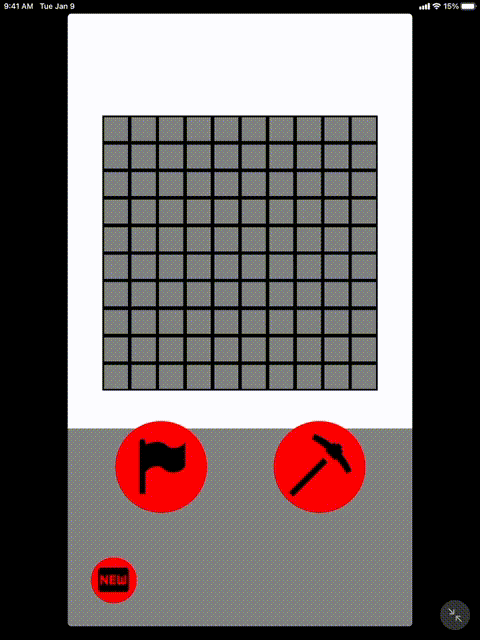

Here is my attempt at creating an app using [`Reason-React-Native`](https://reason-react-native.github.io/)

Code overview:

So the purpose of this app was a personal challenge (and school project) to pracitce using a functional paradigm. ReasonML is built using OCaml and has most functional features that you might see in a language such as Haskell. However, ReasonML isn't quite as feature rich. ReasonML also isn't strictly pure, so there are some functions I've written here that probably aren't the best "efficiency" wise, but the goal of this project was to write in a "functional style". So I choose pure functions over what is necessarily the best way to write in ReasonML.

The app is a simpl 5 .re files:

App.re - where the app kicks off. Mostly boilerplate.

Board.re - The top half of the screen UI. This is also where the main callback functions happen to the actual game code. The board.re code itself though is pretty simple. The functions it calls all return an updated board.

Cell.re - The individual cells in the board.

ControllerView.re - the bottom half that has 3 buttons: the flag button, the "reveal" (pickaxe) button, and the "new game button".

Minesweeper.re - The actual game logic and types. This where the meat of the ReasonML code actually lives.